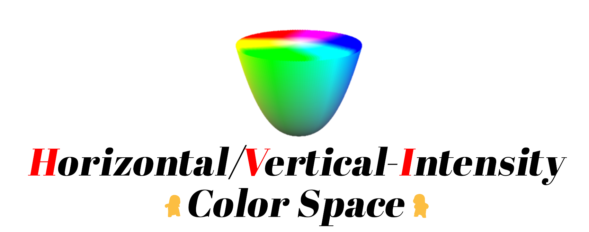
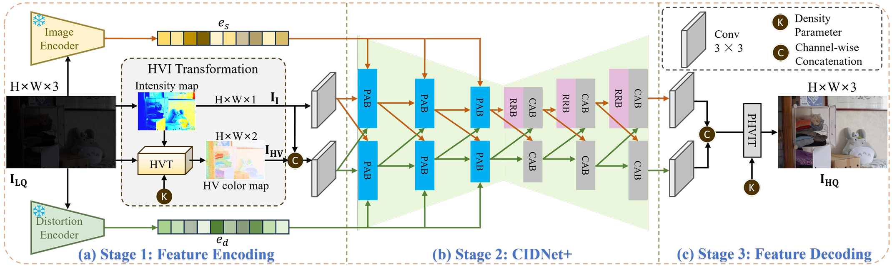
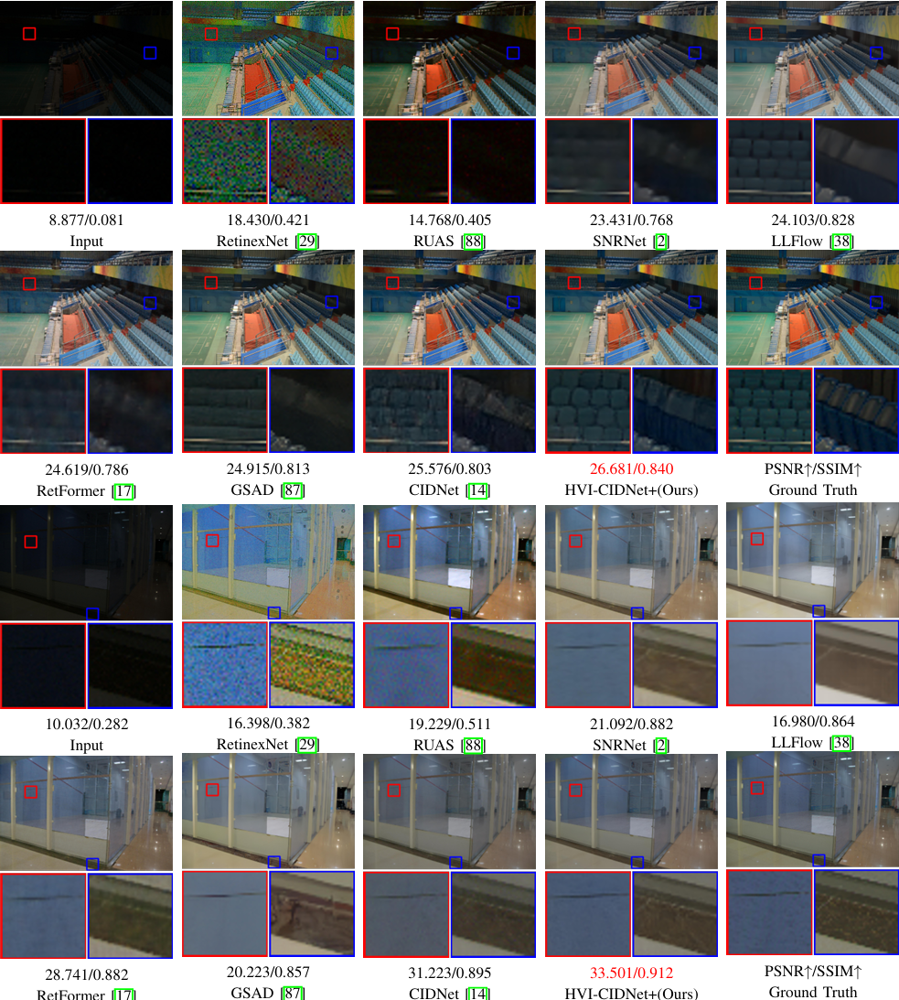
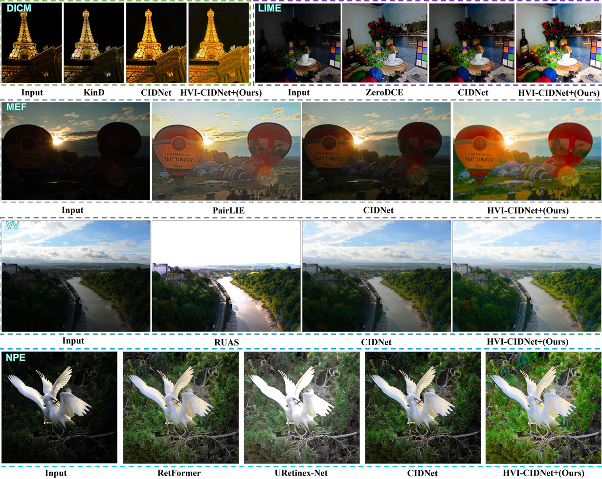

&nbsp;

<p align="center">  </p>

# [CVPR2025] HVI: A New Color Space for Low-light Image Enhancement

**[Qingsen Yan](https://scholar.google.com/citations?user=BSGy3foAAAAJ)<sup>∗ </sup>, [Yixu Feng](https://scholar.google.com/citations?user=WljJ2HUAAAAJ)<sup>∗ </sup>, [Cheng Zhang](https://scholar.google.com/citations?user=L_Av9NcAAAAJ)**,  [Guansong Pang](https://scholar.google.com/citations?user=1ZO7pHkAAAAJ), Kangbiao Shi, [Peng Wu](https://scholar.google.com/citations?user=QkNqUH4AAAAJ), Wei Dong, Jinqiu Sun,  [Yanning Zhang](https://scholar.google.com/citations?user=-wzlS7QAAAAJ)

Previous Version: [You Only Need One Color Space: An Efficient Network for Low-light Image Enhancement](https://arxiv.org/abs/2402.05809)


</details>

## News 🆕
- **2025.06.03** Special Thanks for Kangbiao Shi for training HVI-CIDNet on FiveK dataset follow retinexformer. The training code and models are avaliable now. 🔆
- **2025.05.01** Our NTIRE2025 LLIE track championship solution, FusionNet, is now public at [Arxiv](https://arxiv.org/pdf/2504.19295)! 📝
- **2025.03.27** Congratulations! Our team achived [1st place](https://drive.google.com/file/d/1CSXNssZQK5Y_KUWUx3_nYLv-plJn_K43/view) in the competition: [NTIRE 2025 Low Light Image Enhancement Challenge](https://codalab.lisn.upsaclay.fr/competitions/21636) (If you have any question about our NTIRE method, please contact: Kangbiao Shi, email: 18334840904@163.com). We fused our HVI-CIDNet with last year's winner and runner-up models to get the optimal results. We will explain the fusion method thoroughly in detail in the report for subsequent reference. 🚀
- **2025.03.10** All weights are public at [Hugging Face](https://huggingface.co/papers/2502.20272). Special Thanks to [Niels Rogge](https://github.com/NielsRogge), [Wauplin](https://github.com/Wauplin), and [hysts](https://huggingface.co/hysts).🔆
- **2025.02.26** Congratulations! Our final-version paper "HVI: A New color space for Low-light Image Enhancement" has been accepted by **CVPR 2025**. 🔥
- **2025.02.20** A test demo of our model is available on [Hugging Face](https://huggingface.co/spaces/Fediory/HVI-CIDNet_Low-light-Image-Enhancement_). 🤗
- **2025.01.31** Update train code. Use random gamma function (enhancement curve) to improve cross-dataset generalization. 🔆
- **2024.06.19** Update newest version of paper in [Arxiv](https://arxiv.org/abs/2402.05809). 📝
- **2024.05.12** Update peer results on LOLv1. 🤝
- **2024.04.28** Synchronize all Baidu Pan datasets, outputs, and weights to One Drive. 🌎
- **2024.04.18** Full version Code, models, visual comparison have been released. We promise that all the weights only trained on train sets, and each weights is reproducible. Hope it will help your future work. If you have trained a better result, please contact us. We look forward to subsequent work based on the HVI color "space"! 💎

- **2024.04.14** Update test fine tuning result and weights on LOLv1 dataset. 🧾

- **2024.03.04** Update five unpaired datasets (DICM, LIME, MEF, NPE, VV) visual results. ✨

- **2024.03.03** Update pre-trained weights and output results on our HVI-CIDNet using Baidu Pan. 🧾

- **2024.02.08** Update HVI-CIDNet original-version paper as "You Only Need One Color Space: An Efficient Network for Low-light Image Enhancement" in [Arxiv](https://arxiv.org/abs/2402.05809v1). The new code, models and results will be uploaded. 🎈


## Proposed HVI-CIDNet ⚙ 

<details open>
<summary><b>Motivation:</b></summary>


</details>

<details close>
<summary><b>HVI-CIDNet pipeline:</b></summary>



</details>

## Visual Comparison 🖼 
<details close>
<summary><b>LOL-v1, LOL-v2-real, and LOL-v2-synthetic:</b></summary>



</details>

<details close>
<summary><b>DICM, LIME, MEF, NPE, and VV:</b></summary>




</details>

## 1. Get Started 🌑

### Dependencies and Installation

(1) Clone Repo

```bash
git clone git@github.com:shikangbiao/CIDNet_extension.git
```

(2) Install Dependencies

```bash
conda env create -f HVI-CIDNet+.yaml
```


### Data Preparation

You can refer to the following links to download the datasets.

- [LOLv1](https://daooshee.github.io/BMVC2018website/)
- LOLv2: [Baidu Pan](https://pan.baidu.com/s/17KTa-6GUUW22Q49D5DhhWw?pwd=yixu) (code: `yixu`) and  [One Drive](https://1drv.ms/u/c/2985db836826d183/EYPRJmiD24UggCmCAQAAAAABEbg62rx0FG21FwLQq0jzLg?e=Im12UA) (code: `yixu`) 
- DICM,LIME,MEF,NPE,VV: [Baidu Pan](https://pan.baidu.com/s/1FZ5HWT30eghGuaAqqpJGaw?pwd=yixu)(code: `yixu`) and [One Drive](https://1drv.ms/f/s!AoPRJmiD24UphBNGBbsDmSwppNPf?e=2yGImv)(code: `yixu`)
- SICE: [Baidu Pan](https://pan.baidu.com/s/13ghnpTBfDli3mAzE3vnwHg?pwd=yixu)(code: `yixu`) and [One Drive](https://1drv.ms/u/s!AoPRJmiD24UphAlaTIekdMLwLZnA?e=WxrfOa)(code: `yixu`)
- Sony-Total-Dark(SID): [Baidu Pan](https://pan.baidu.com/s/1mpbwVscbAfQJtkrrzBzJng?pwd=yixu)(code: `yixu`) and [One Drive](https://1drv.ms/u/s!AoPRJmiD24UphAie9l0DuMN20PB7?e=Zc5DcA)(code: `yixu`)

Then, put them in the following folder:

<details close> <summary>datasets (click to expand)</summary>

```
├── datasets
	├── DICM
	├── LIME
	├── LOLdataset
		├── our485
			├──low
			├──high
		├── eval15
			├──low
			├──high
	├── LOLv2
		├── Real_captured
			├── Train
				├── Low
				├── Normal
			├── Test
				├── Low
				├── Normal
		├── Synthetic
			├── Train
				├── Low
				├── Normal
			├── Test
				├── Low
				├── Normal
	├── MEF
	├── NPE
	├── SICE
		├── Dataset
			├── eval
				├── target
				├── test
			├── label
			├── train
				├── 1
				├── 2
				...
		├── SICE_Grad
		├── SICE_Mix
		├── SICE_Reshape
	├── Sony_total_dark
		├── eval
			├── long
			├── short
		├── test
			├── long
				├── 10003
				├── 10006
				...
			├── short
				├── 10003
				├── 10006
				...
		├── train
			├── long
				├── 00001
				├── 00002
				...
			├── short
				├── 00001
				├── 00002
				...
	├── VV
```
</details>

## 2. Testing 🌒


Download our weights from [[Google Drive](https://drive.google.com/drive/folders/1bHNXq-3nSxh0QeyeG4dqcxtXw-Y-JbUY?usp=drive_link)]

- **You can test our HVI-CIDNet+ as followed, all the results will saved in `./output` folder:**

<details close> <summary>(click to expand)</summary>

```bash
# LOLv1
python eval.py --lol

# LOLv2-real
python eval.py --lol_v2_real

# LOLv2-syn
python eval.py --lol_v2_syn

# SICE
python eval.py --SICE_grad # output SICE_grad
python eval.py --SICE_mix # output SICE_mix

# Sony-Total-Dark
python eval_SID.py --SID

# five unpaired datasets DICM, LIME, MEF, NPE, VV. 
# You can change "--DICM" to the other unpaired datasets "LIME, MEF, NPE, VV".
python eval.py --unpaired --DICM
```

</details>

- **Also, you can test all the metrics mentioned in our paper as follows:**
  
  
<details close> <summary>(click to expand)</summary>

```bash
# LOLv1
python measure.py --lol

# LOLv2-real
python measure.py --lol_v2_real

# LOLv2-syn
python measure.py --lol_v2_syn

# Sony-Total-Dark
python measure_SID.py --SID

# SICE-Grad
python measure.py --SICE_grad

# SICE-Mix
python measure.py --SICE_mix

# five unpaired datasets DICM, LIME, MEF, NPE, VV. 
# You can change "--DICM" to the other unpaired datasets "LIME, MEF, NPE, VV".
python measure_niqe_bris.py --DICM

# Note: Following LLFlow, KinD, and Retinxformer, we have also adjusted the brightness of the output image produced by the network, based on the average value of GroundTruth (GT). This only works in paired datasets. If you want to measure it, please add "--use_GT_mean".
# 
# e.g.
python measure.py --lol --use_GT_mean
  
```

</details>

- **Evaluating the Parameters, FLOPs, and running time of HVI-CIDNet+:**

```bash
python net_test.py
```


## 3. Training 🌓

The training code will be uploaded soon.

## 4. Contacts 🌔

If you have any questions, please contact us or submit an issue to the repository!

Kangbiao Shi (18334840904@163.com)

## 5. Citation 🌕

If you find our work useful for your research, please cite our paper

```
@article{yan2025hvi,
  title={HVI-CIDNet+: Beyond Extreme Darkness for Low-Light Image Enhancement},
  author={Yan, Qingsen and Shi, Kangbiao and Feng, Yixu and Hu, Tao and Wu, Peng and Pang, Guansong and Zhang, Yanning},
  journal={arXiv preprint arXiv:2507.06814},
  year={2025}
}

@inproceedings{yan2025hvi,
  title={Hvi: A new color space for low-light image enhancement},
  author={Yan, Qingsen and Feng, Yixu and Zhang, Cheng and Pang, Guansong and Shi, Kangbiao and Wu, Peng and Dong, Wei and Sun, Jinqiu and Zhang, Yanning},
  booktitle={Proceedings of the Computer Vision and Pattern Recognition Conference},
  pages={5678--5687},
  year={2025}
}
```
